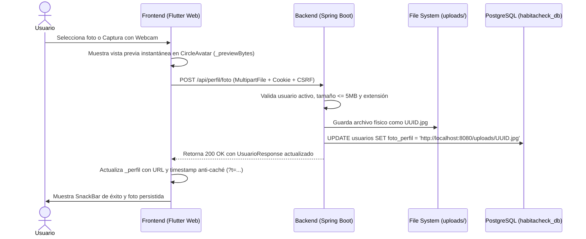

# Documentación Técnica: Historia de Usuario HU04
## Gestión y Actualización de Foto de Perfil

---

### 1. Resumen de la Historia de Usuario
* **Identificador:** HU04
* **Título:** Actualización y Gestión de Foto de Perfil de Usuario
* **Objetivo:** Permitir a los usuarios autenticados personalizar su perfil mediante la carga de una fotografía (desde la galería o cámara web/dispositivo), visualizarla de forma inmediata y eliminarla para restablecer el avatar institucional por defecto.
* **Modelo de Datos:** Cumplimiento estricto con el modelo relacional oficial de la plataforma (`usuarios.foto_perfil`).

---

### 2. Escenarios Cubiertos

| Escenario | Descripción | Comportamiento Implementado |
| :--- | :--- | :--- |
| **Escenario 1** | Actualización exitosa de foto de perfil | El usuario selecciona o captura una imagen válida (JPG, PNG, WEBP $\le$ 5 MB). Se muestra vista previa instantánea en memoria, se envía al servidor mediante multipart/form-data, se almacena en disco y se actualiza la URL en la base de datos PostgreSQL. |
| **Escenario 2** | Subida de archivo no soportado o que excede el tamaño | Si el archivo supera los 5 MB o no es una imagen válida, el sistema rechaza la petición tanto en el cliente como en el backend con un mensaje claro y conserva la foto previa intacta. |
| **Escenario 3** | Eliminación de foto y restauración de avatar | El usuario confirma la eliminación. El backend borra el archivo físico, actualiza `foto_perfil = NULL` en la BD y la interfaz muestra de inmediato el avatar con la inicial del usuario. |

---

### 3. Componentes Creados y Modificados en el Frontend (`front-check`)

#### A. Nuevos Archivos Creados:

1. **`lib/features/profile/data/perfil_service.dart`**
   * **Propósito:** Capa de acceso a datos para la gestión del perfil.
   * **Lógica implementada:**
     - `obtenerMiPerfil()`: Consulta `GET /api/perfil` con cookies de sesión y CSRF.
     - `actualizarFotoPerfil(XFile imagen)`: 
       - Valida en el cliente la extensión (`.jpg`, `.jpeg`, `.png`, `.webp`) y el tamaño máximo (5 MB).
       - Detecta el MIME type usando `package:mime`.
       - Empaqueta el archivo binario en una petición HTTP Multipart (`foto`) enviada a `POST /api/perfil/foto`.
     - `eliminarFotoPerfil()`: Envía una petición `DELETE /api/perfil/foto` para remover la foto.

2. **`lib/features/profile/presentation/pages/perfil_screen.dart`**
   * **Propósito:** Interfaz de usuario completa para la gestión de perfil.
   * **Lógica implementada:**
     - **Avatar interactivo:** `CircleAvatar` con borde en degradado, botón flotante de cámara y overlay de carga (`CircularProgressIndicator`) durante operaciones asíncronas.
     - **Vista previa instantánea en memoria (`_previewBytes`):** En cuanto el usuario selecciona o captura una foto, se renderiza de inmediato en pantalla sin esperar la latencia de la red.
     - **Cache-Busting (`?t=timestamp`):** Evita que el navegador mantenga en caché una imagen antigua al actualizarla.
     - **Resolución de URLs relativas:** Normaliza URLs como `/uploads/...` al host completo (`http://localhost:8080/uploads/...`).
     - **Menú inferior interactivo (`_mostrarOpcionesFoto`):** Opciones claras para elegir de galería, tomar foto con cámara o eliminar foto existente con diálogo de confirmación.
     - **Información del usuario:** Visualización de nombre, correo, teléfono y badges de roles activos.

3. **`lib/core/utils/camera_helper.dart`**
   * **Propósito:** Abstracción con importación condicional (`dart.library.html`) para permitir el funcionamiento de la cámara tanto en aplicaciones Web de escritorio como en dispositivos móviles nativos.

4. **`lib/core/utils/camera_helper_stub.dart`**
   * **Propósito:** Implementación para plataformas móviles (Android / iOS). Usa `ImagePicker.pickImage(source: ImageSource.camera)` para abrir la app de cámara nativa del sistema.

5. **`lib/core/utils/camera_helper_web.dart`**
   * **Propósito:** Implementación WebRTC para navegadores web de escritorio (Google Chrome en macOS / Windows).
   * **Lógica implementada:**
     - Invoca `navigator.mediaDevices.getUserMedia({video: true})` para solicitar acceso a la cámara web real de la computadora.
     - Monta un elemento HTML `<video>` dentro de un diálogo Flutter (`HtmlElementView`).
     - Renderiza un visor con vista previa en vivo y botón **"Capturar Foto"**.
     - Al capturar, dibuja el frame actual en un `CanvasElement`, extrae los bytes en JPEG y los retorna como un `XFile` listo para subirse al servidor.
     - Detiene los tracks de video al cerrar para apagar el indicador de la cámara.

#### B. Archivos Modificados:

1. **`lib/core/network/api_client.dart`**
   * Se añadió el método `delete(String path)` con inyección automática de cookies de sesión (`JSESSIONID`) y encabezado CSRF (`X-XSRF-TOKEN`).
2. **`lib/core/router/app_router.dart`**
   * Se dio de alta la ruta `/perfil` vinculada al widget `PerfilScreen`.
3. **Dashboards (`home_screen.dart`, `arrendador_dashboard_screen.dart`, `servicios_dashboard_screen.dart`)**
   * Se incorporó en el `AppBar` el botón directo hacia `/perfil`.
4. **`pubspec.yaml`**
   * Se añadió la dependencia `mime: ^2.0.0` para la detección precisa del Content-Type de imágenes.
5. **`analysis_options.yaml`**
   * Se optimizó el analizador excluyendo carpetas generadas de plataforma y compilación.

---

### 4. Componentes Creados y Modificados en el Backend (`back-check`)

#### A. Nuevos Archivos Creados:

1. **`src/test/java/com/equipo404/arrendamiento/PerfilFotoServiceTests.java`**
   * **Propósito:** Pruebas unitarias automatizadas con Mockito y JUnit 5 que validan los tres escenarios de negocio de la HU04:
     - `actualizarFotoPerfil_archivoValido_actualizaYRetornaUsuario()`
     - `actualizarFotoPerfil_archivoNoValido_lanzaExcepcion()`
     - `actualizarFotoPerfil_archivoExcedeTamano_lanzaExcepcion()`
     - `eliminarFotoPerfil_usuarioConFoto_eliminaYRetornaUsuarioSinFoto()`

#### B. Archivos Creados / Modificados en la API:

1. **`src/main/java/com/equipo404/arrendamiento/controller/PerfilController.java`**
   * Expone los endpoints REST bajo `/api/perfil`:
     - `GET /api/perfil`: Retorna el DTO `UsuarioResponse` del usuario autenticado.
     - `POST /api/perfil/foto` (multipart/form-data): Recibe el parámetro `foto`, `imagen` o `archivo`.
     - `DELETE /api/perfil/foto`: Elimina la foto del perfil.

2. **`src/main/java/com/equipo404/arrendamiento/service/PerfilService.java`**
   * **Lógica implementada:**
     - Valida que el usuario exista y tenga estado `activo`.
     - Almacena el archivo nuevo vía `FileStorageService.storeImage(archivo)`.
     - Construye la URL de descarga: `http://localhost:8080/uploads/{nombreArchivo}`.
     - Guarda la URL en el campo `foto_perfil` de PostgreSQL.
     - Si existía una foto anterior, invoca `eliminarArchivoFisicoSiExiste()` para liberar espacio en disco.

3. **`src/main/java/com/equipo404/arrendamiento/service/FileStorageService.java`**
   * Crea y administra la carpeta local `uploads/`.
   * Valida extensiones y límite de 5 MB.
   * Asigna identificadores únicos UUID (`UUID.randomUUID().toString() + extension`) para evitar colisiones de nombres.

4. **`src/main/java/com/equipo404/arrendamiento/config/WebConfig.java`** *(Corrección de infraestructura)*
   * Configura el `ResourceHandler` para `/uploads/**`.
   * **Solución aplicada:** Se reemplazó `"file:/" + uploadPath + "/"` (que en macOS causaba `file://Users/...` con 2 diagonales interpretadas como host de red) por `uploadDir.toUri().toString()` (`file:///Users/...`), permitiendo que el servidor entregue los archivos estáticos con `HTTP 200 OK`.

5. **`src/main/java/com/equipo404/arrendamiento/security/SecurityConfig.java`** *(Corrección de seguridad)*
   * Se configuró el acceso público a `/uploads/**` y `/error` sin restringir a métodos HTTP específicos, garantizando que el navegador pueda descargar las imágenes sin requerir sesión para ese recurso estático.

6. **`.gitignore`**
   * Se agregó la regla `uploads/` para evitar que las fotos de prueba binarias se suban al repositorio Git.

---

### 5. Flujo de Datos End-to-End

---

### 6. Historial de Commits en Git

* **Repositorio Frontend (`JesusRuizChico/front-check`):**
  - Rama: `develop` (y `sprint-2/hu03-hu04`)
  - Commit `d373d66`: `feat(perfil): implementar pantalla y servicio de actualizacion de foto de perfil (HU04)`
  - Commit `91381fc`: `feat(perfil): integrar captura de camara web real en navegador y vista previa inmediata de foto de perfil (HU04)`

* **Repositorio Backend (`JesusRuizChico/back-check`):**
  - Rama: `develop` (y `sprint-2/hu04-foto-perfil`)
  - Commit `7056bef`: `feat(perfil): implementar actualizacion y eliminacion de foto de perfil (HU04)`
  - Commit `04cf315`: `fix(perfil): asegurar generacion resiliente de URL de descarga en PerfilService`
  - Commit `221bd3c`: `fix(security): corregir mapeo de recursos estaticos para uploads y habilitar acceso publico`
